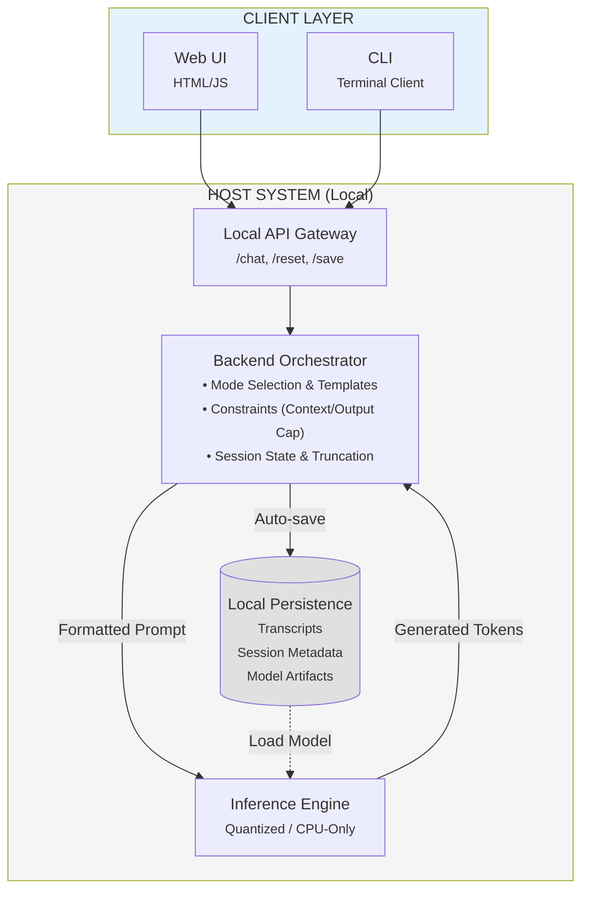

# Pocket Brain

Offline quantized LLM brainstorming under CPU-only and ≤8GB RAM constraints.

## Project Overview

Pocket Brain is a portable, fully offline conversational assistant for private brainstorming on constrained hardware. It targets CPU-only execution with a strict memory budget of ≤8GB RAM while maintaining predictable latency. The system integrates existing quantized open-weight LLMs through a local API, exposing structured interaction modes that improve output quality without increasing computational requirements.

Pocket Brain v1 is scoped as a personal, single-user tool. Design decisions prioritize determinism, portability, and explicit resource control over feature breadth. This is a systems engineering project focused on orchestrating quantized inference, enforcing bounded context growth, and providing structured prompting—not a commercial product.

**What Pocket Brain is not:**
- Not a cloud service or multi-user platform
- Not a training or fine-tuning framework
- Not a production-ready consumer product
- Not a GPU-dependent system

## Core Constraints

- **Offline-only**: no outbound network calls required for inference or interaction
- **CPU-only**: runs without GPU acceleration
- **≤8GB RAM**: total runtime memory must stay within this budget
- **Portable local storage**: models and session artifacts reside on local disk/SSD

## High-Level Architecture



**Architecture separates orchestration policy from raw inference.** Clients are thin; all core logic lives server-side in the orchestrator layer.

## How Conversation Memory Works

Large Language Models are **stateless** at inference time. They do not store chat history internally between requests.

Conversational "memory" is implemented by the **application layer** by resending a bounded subset of the transcript along with each new user message. This means every model call includes:

- System prompt (global behavior)
- Mode prompt (task framing)
- Selected conversation history (bounded window)
- Current user message

If the prompt exceeds the model's context window, the application must drop or compress older content. Therefore, conversation continuity is a **systems policy decision**, not a property of the model.

### Sliding Window Policy

Pocket Brain enforces a **sliding window** of the last $N$ user-assistant exchanges (e.g., $N=10$). Older turns are persisted to disk but dropped from the active inference context. This bounds KV cache growth and ensures predictable latency under ≤8GB RAM.

### Session Rollover

The **New Chat** operation terminates the active session, auto-saves the transcript to disk, and creates a new session. This provides a user-visible way to reset context and maintain responsiveness.

## Interaction Modes

Pocket Brain enforces **one mode per session**, selected at session creation.

Example modes:
- `perspectives`: generate alternative viewpoints and angles
- `risks`: identify weaknesses, failure modes, and unknowns
- `next_steps`: produce actionable next actions and priorities

**Rationale:** Mode scoping stabilizes behavior on smaller models by avoiding multi-mode instruction stacking. Each mode is implemented as a prompt template rather than requiring model switching.

## Model Strategy (v1)

Pocket Brain does not train or fine-tune models. It integrates existing **open-weight, instruction-tuned models** that have been quantized (GGUF or equivalent) for efficient CPU inference.

### Candidate Models

v1 considers the following models as viable options:

| Model | Size | Target Quant | Strengths | Role |
|-------|------|--------------|-----------|------|
| **Qwen2.5 Instruct** | 3B | Q4/Q5 | Balanced quality/speed, strong instruction following | **Default** |
| Phi-3 Mini | 3.8B | Q4/Q5 | Fast iteration, low memory pressure | Alt-fast |
| Mistral Instruct | 7B | Q4 | Higher coherence, better complex reasoning | Optional |

v1 defaults to a **single-model strategy**. Interaction modes are implemented as prompt templates rather than model switching. This minimizes operational complexity and preserves consistent behavior across sessions.

## What's Implemented vs Planned

### Current Scope (v1)

- Text-only interaction
- Single quantized model
- Fixed interaction modes per session
- Sliding window context truncation
- Local persistence of transcripts

### Planned Extensions

Future versions may explore (not required for v1):

- Multi-profile inference (fast vs deep)
- Improved launchers for Windows and macOS
- Optional import/export tooling
- Limited multimodal extensions

## Non-Goals

Pocket Brain explicitly excludes:

- Model training or fine-tuning
- Long-document ingestion or RAG in v1
- Multi-user authentication and cloud deployment
- GPU acceleration requirements
- Outbound network dependencies

## Repository Structure

```
/docs           Whitepaper, design documentation
/api            Local API service (endpoints, session management)
/orchestrator   Backend policy layer (modes, context caps, truncation)
/engine         Inference integration (quantized model loading)
/clients        Web UI and CLI clients
/storage        Persistence layer (transcript logs, metadata)
```

## Implementation Plan

### Milestone 1: End-to-End Skeleton
- API service running locally
- Session creation, chat request, and response
- Auto-save transcript to disk on demand

### Milestone 2: Enforced Constraints
- Fixed mode per session
- Sliding window history (last $N$ exchanges)
- Output caps (max tokens) and context caps

### Milestone 3: Usability
- Web UI and CLI client parity
- "New Chat" rollover and clear chat controls
- Health/status endpoint + basic logging

## Context Management Parameters

| Parameter | Default (v1) | Rationale |
|-----------|--------------|-----------|
| Mode per session | Fixed | Keeps prompts stable and avoids instruction stacking |
| History window | Last $N=10$ exchanges | Bounds KV cache growth to ensure predictable latency |
| Output cap | Configurable max tokens | Prevents runaway responses on CPU |
| New chat behavior | Auto-save then reset | Provides user-visible rollover and clear state |
| Hard stop | Off by default | Truncation is sufficient; hard stop is optional UX |

## License

TBD

## Authors

Akbar Aman & Luke Abraham, 2026
